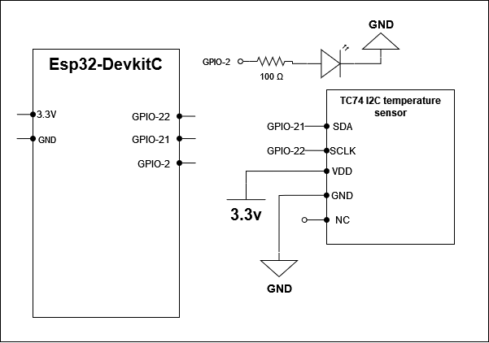
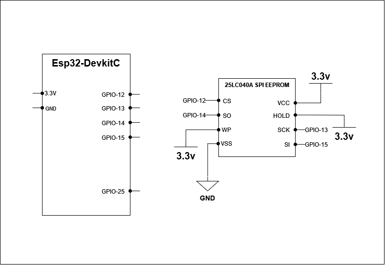
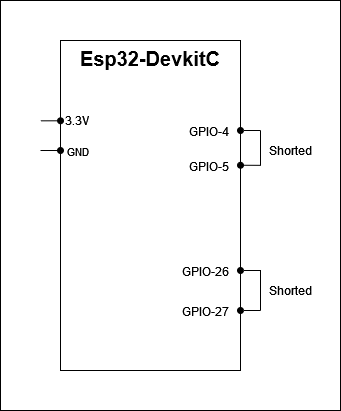
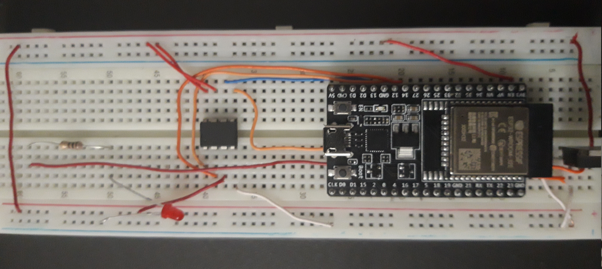
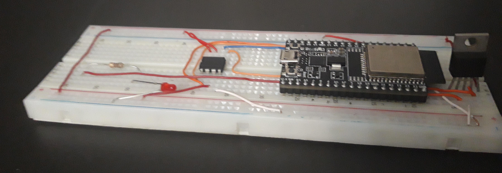
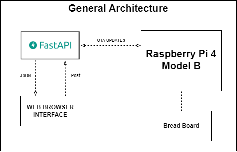
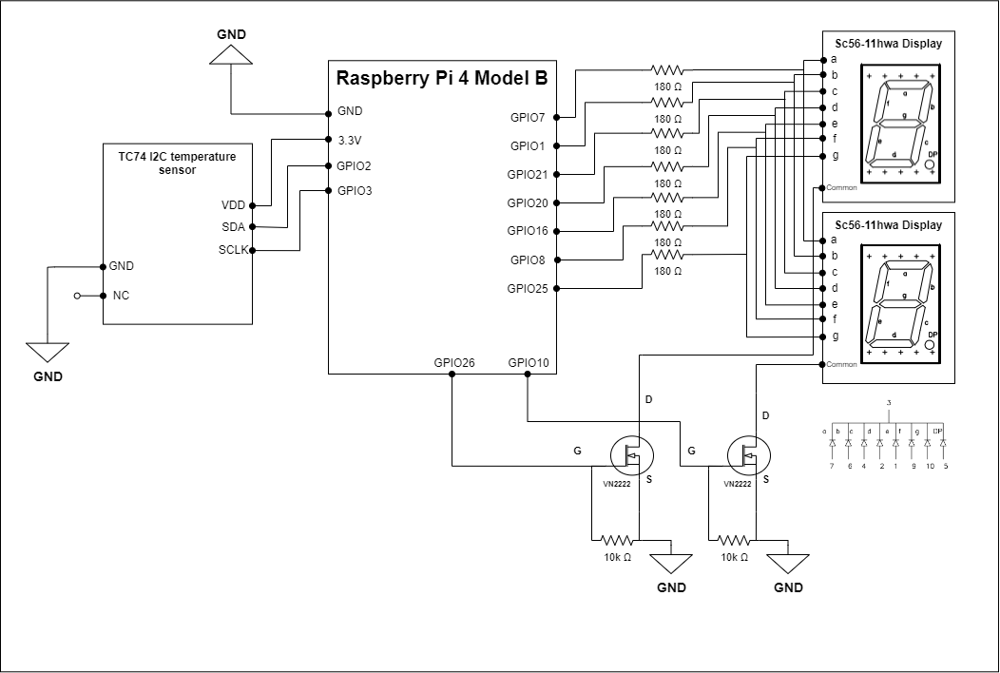
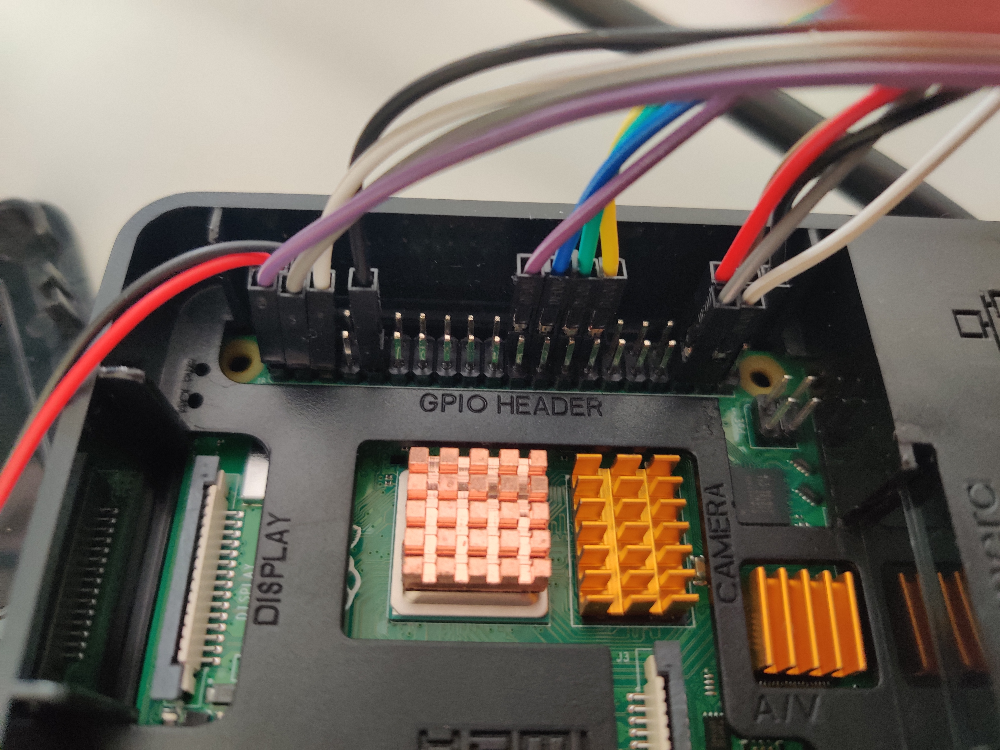
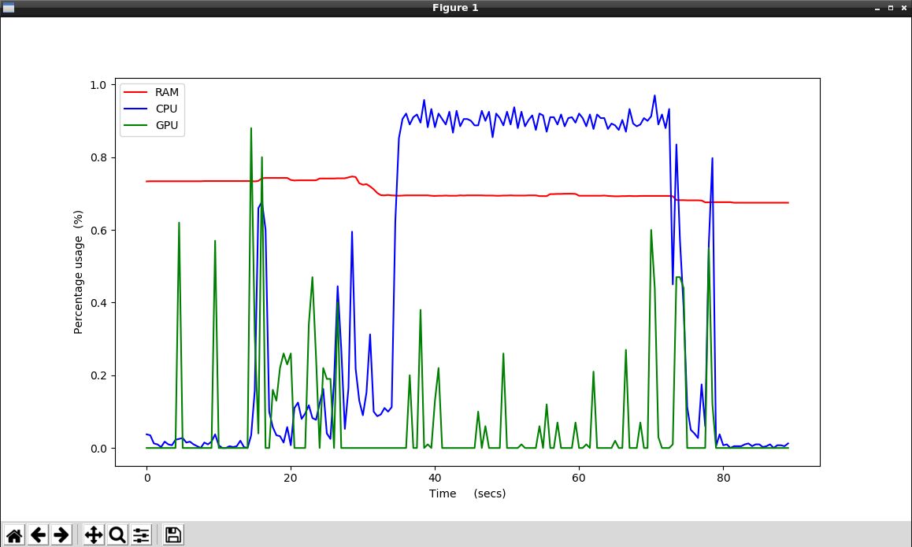
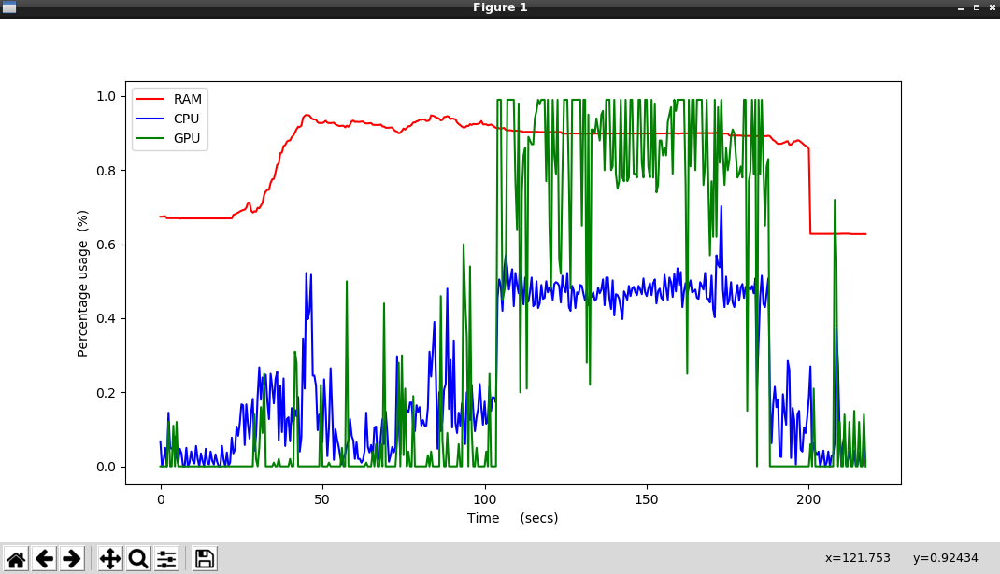

# ASE_TP2_G6
ADC_UART/I2C_PWM/SPI_DAC Mini Projects for the class of Arquiteturas para Sistemas Embutidos regarding the ESP32 architecture.

App_RPi Mini Project for the class of Arquiteturas para Sistemas Embutidos regarding the RaspberryPi architecture.

# Application 1: I2C + PWM
In this app we use I2C communication to get the temperature reading from the TC74 temperature sensor. Then with this value, we use the led pwm controller to control the luminosity intensity of a led. So if the temperature is increased the luminosity gets stronger, otherwise it gets weaker.
In this module when the temperature sensor is not reading he is set to stanby mode, by doing this we minimize his power consuption.

### Logical schematic diagram


# Application 2: SPI + DAC
In this app the ESP32-DevKitC SPI Master Driver is used to write data to the device 25LC040A SPI EEPROM , this data is then read and set as the output for the DAC channel 1. Each two iterations the eeprom is written with incrementing or decrementing values depending how it was before. In the begining of the program you can choose if you want to overwrite the data currently in the eeprom. 
### Logical schematic diagram


# Application 3: ADC + UART
In this app the ESP32-DevKitC the DAC module is used to create a voltage that is read by the ADC then the data read is sent to the Uart that has the TXD_PIN and RXD_PIN shorted so it will comunicate with itself after the data is received it will be echoed.At the next transmission the DAC is set to higher voltage and so on.
### Logical schematic diagram



## Possible breadboard implementation





# Application RaspberryPi
This project consists in a web server to choose what to be presented in a dual multiplexed 7 segment display.
In the web server the user can choose between 4 diferent functions that will change what will be presented in the displays

* Function 1 - "Nothing" - The displays will blink and turn off.
* Function 2 - "Ambient Temperature" - The displays will present the temperature read in the TC74 temperature sensor.
* Function 3 - "Chip Temperature" - The displays will present the temperature on the raspberry pi chip.
* Function 4 - "Date" - The displays will present the current date.

### General Architecture Diagram



### Logical Schematic Diagram

    

## Possible breadboard implementation



# Application NvidiaJetson Nano
This project consists of a program that will detect based on video feed from a camera if a human face is wearing a mask and it will do so with the help of the GPU and another program that detects a human face and it will do so with the CPU. Simultaneously the command ```bash tegrastats ``` should be run to save information of the computing resources currently at use
Afterwards a parser program is run to grab important information from a logfile and to display it in the form of a graph.


### CPU PROGRAM STATS



### GPU PROGRAM STATS

